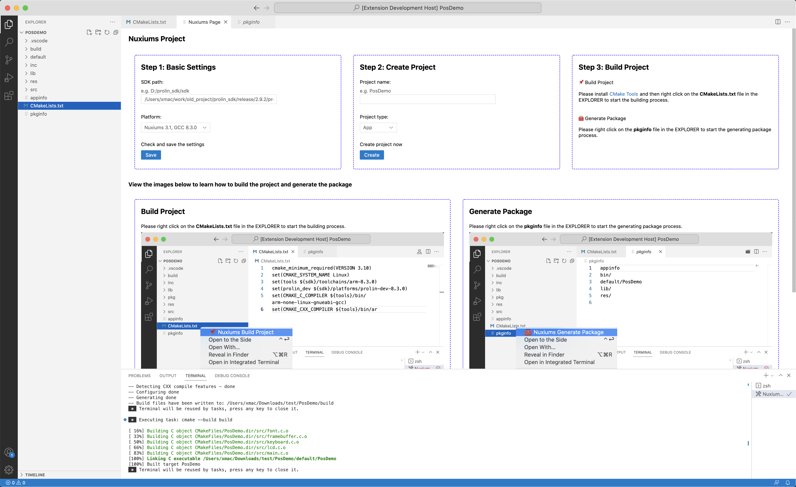

# nuxiums-project README

This extension creates a simple hello-world project.

Build the project by [CMake](https://cmake.org/) and run on PAX Nuxiums terminal.

## Requirements

If you have any requirements or dependencies, add a section describing those and how to install and configure them.

## Known Issues

Calling out known issues can help limit users opening duplicate issues against your extension.

## Release Notes

Users appreciate release notes as you update your extension.

### 1.0.x

Initial release.

##  Knowledge

### For more information

+ [VS Code Webview API](https://code.visualstudio.com/api/extension-guides/webview)

**Enjoy!**

